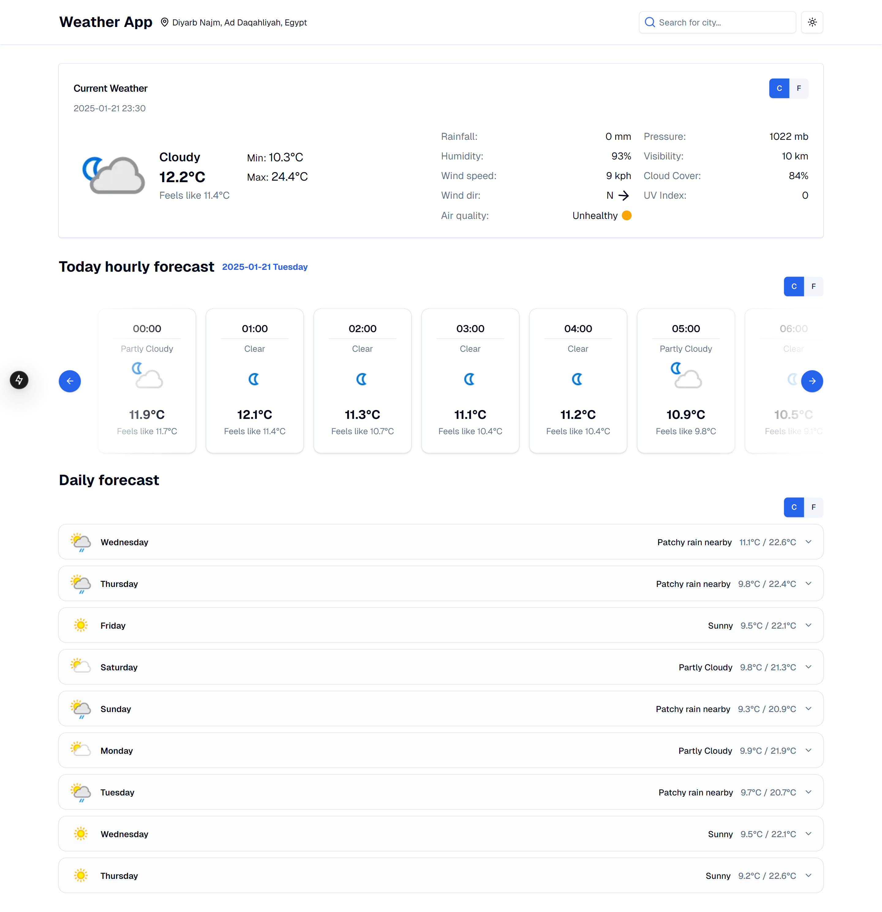
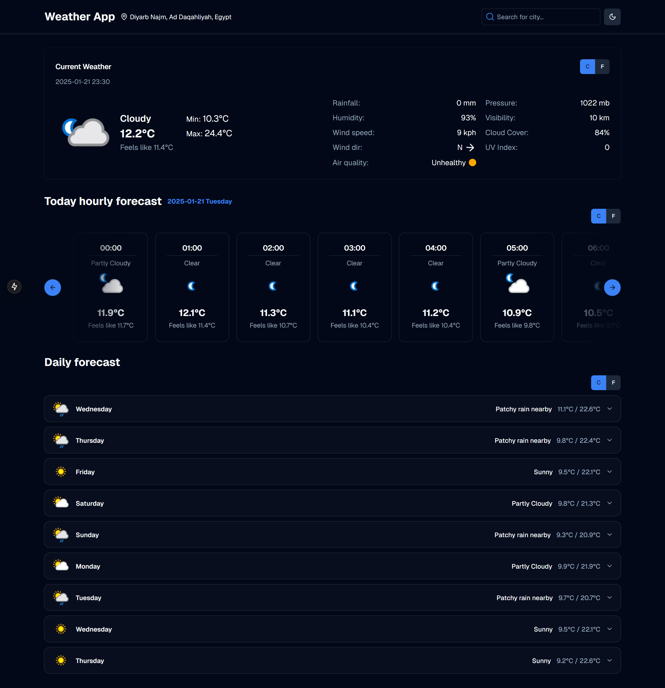
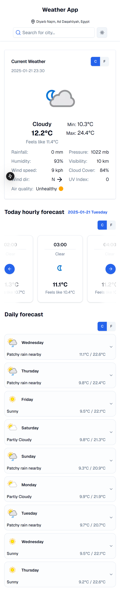
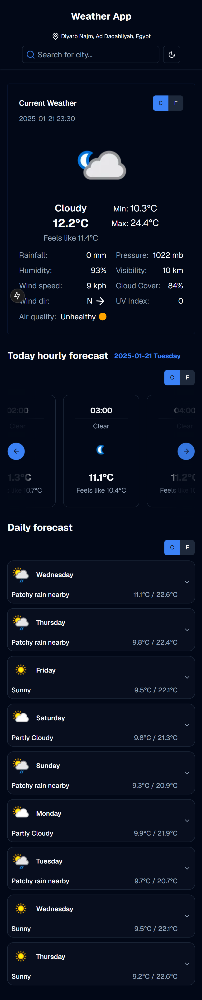

# This is a weeather app using Next.js

##### Desktop light mode



##### Desktop dark mode



##### Mobile light mode



##### Mobile dark mode



## Getting Started

First, run the development server:

```bash
pnpm install

pnpm dev
```
